# 🏠 LazyRoom

**LazyRoom** is a Flutter-based mobile marketplace built for students living in university dormitories. It connects **customers** (students), **suppliers** (in-dorm sellers), and an **admin** in a single app, letting students order everyday products without leaving their room, suppliers manage their own storefront, and admins oversee the whole ecosystem — including a built-in wallet/balance system for payments.

---

## 📖 Overview

Living in a university dorm often means limited access to nearby shops. **LazyRoom** solves this by turning the dorm itself into a marketplace: students browse products listed by in-dorm suppliers, add them to a cart, and place orders — all paid for through an in-app balance rather than cash. Suppliers accept or reject incoming orders, and the admin manages accounts, resolves balances, and keeps the platform running smoothly.

The app is built with a clean, role-based architecture, so each type of user gets a dedicated home screen and workflow tailored to their needs.

---

## ✨ Key Features

### 🔐 Multi-Role Authentication
- Single login screen with automatic routing to the correct home screen based on the user's role: **Customer**, **Supplier**, or **Admin**.
- Token-based authentication with session persistence, so users stay logged in between app launches.
- Dedicated registration flow for new customers, capturing dorm-specific details such as **building** and **room number** for accurate order delivery.

### 🛍️ Customer Experience
- Browse all available products, filterable by category.
- Add items to a cart and review them before checkout.
- Confirm and place orders directly from an in-app wallet balance.
- Track order history and order status (pending, accepted, completed, cancelled).
- View and manage a personal profile.

### 📦 Supplier Tools
- A dedicated supplier dashboard to manage a personal product catalog: add, edit, and delete products (name, description, price, category, and stock).
- Manage incoming orders: **accept** or **reject** customer orders in real time.
- View a personal profile and account balance.

### 🛠️ Admin Control Panel
- Full visibility over all **customer** and **supplier** accounts.
- Create and delete user accounts.
- Ban and unban users to moderate the platform.
- **Deposit** funds into a customer's wallet or **withdraw** funds from a supplier's balance, keeping the in-app economy balanced.

### 💰 Wallet / Balance System
- Every account carries a live balance used to pay for and receive orders, instead of handling cash on delivery.
- Balance can be refreshed on demand and is updated automatically as orders are placed, accepted, or settled by the admin.

### 🎨 Polished UI/UX
- Custom light and dark themes that automatically follow the system setting.
- Reusable, purpose-built widgets (product cards, dialogs, list views) for a consistent look across all three roles.

---

## 🧰 Tech Stack

| Layer                | Technology                                   |
|-----------------------|-----------------------------------------------|
| Framework              | [Flutter](https://flutter.dev)                |
| Language               | Dart                                           |
| State Management       | [Provider](https://pub.dev/packages/provider) |
| Networking             | REST API over HTTP (`http` package)           |
| Local Persistence      | `shared_preferences` (session & balance cache)|
| Architecture           | Role-based MVC-style structure (Models, Views, Services, Providers, Controllers) |

---

## 👥 User Roles

| Role         | Capabilities                                                                 |
|--------------|-------------------------------------------------------------------------------|
| **Customer** | Register, browse products, manage cart, place orders, track order history     |
| **Supplier** | Manage product catalog, accept/reject orders, view balance                    |
| **Admin**    | Manage all accounts, ban/unban users, deposit/withdraw balances               |

---

## 📸 Screenshots

### Onboarding & Authentication

<table>
  <tr>
    <td align="center">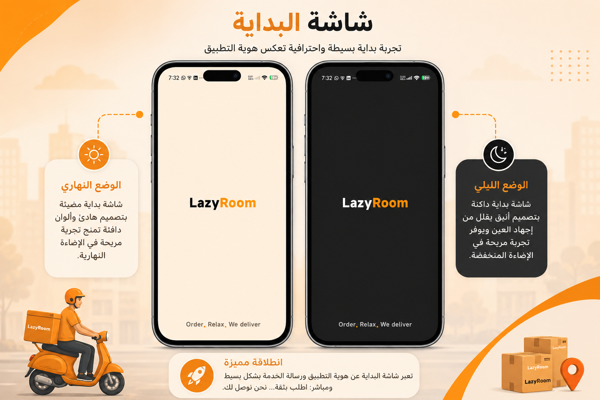<br/><sub>Splash Screen</sub></td>
    <td align="center">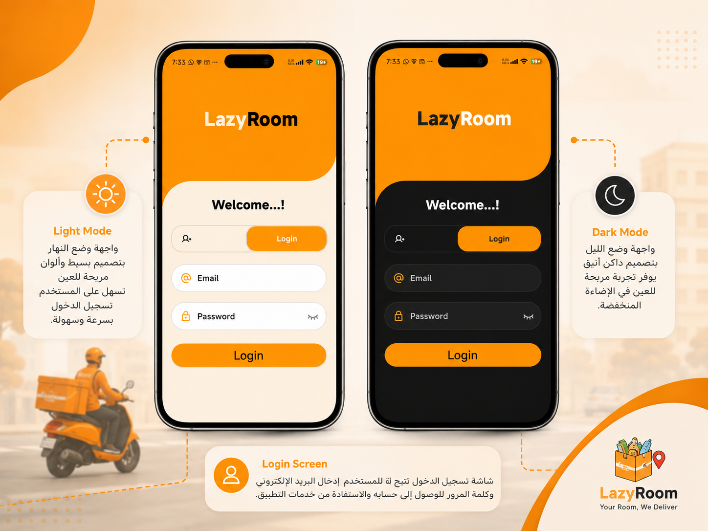<br/><sub>Login</sub></td>
    <td align="center">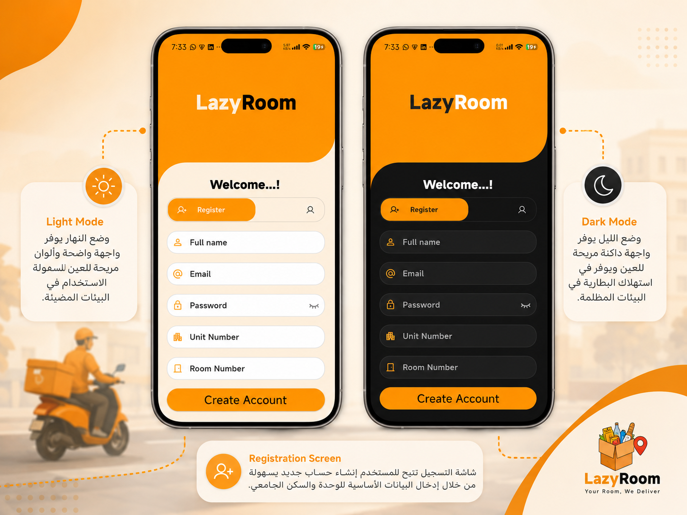<br/><sub>Registration</sub></td>
  </tr>
</table>

### Customer Experience

<table>
  <tr>
    <td align="center">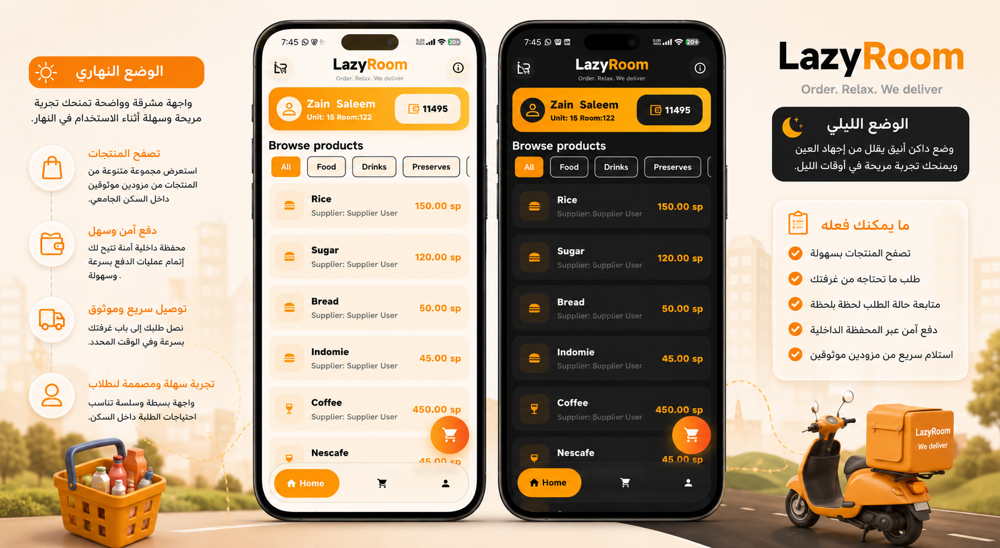<br/><sub>Browse Products</sub></td>
    <td align="center">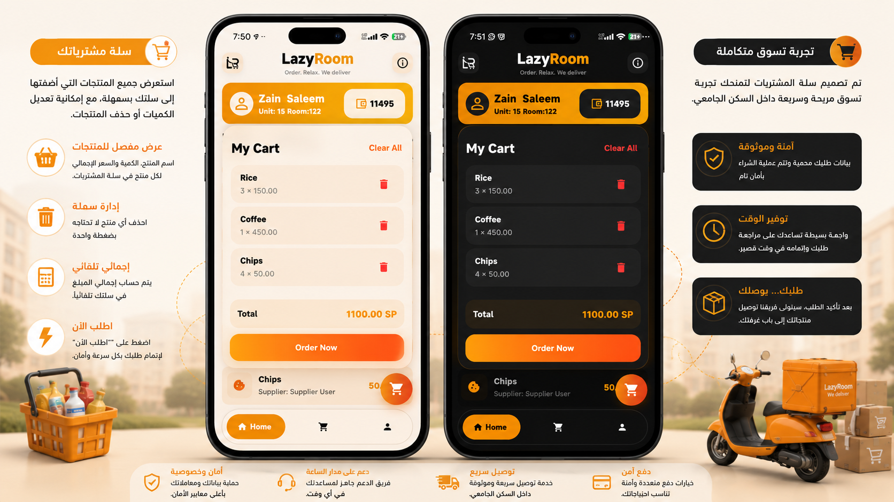<br/><sub>Cart</sub></td>
    <td align="center">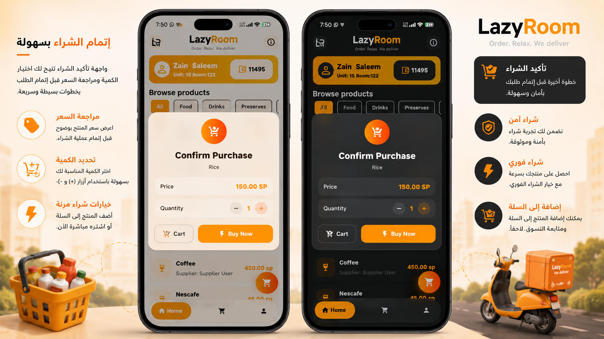<br/><sub>Purchase Confirmation</sub></td>
  </tr>
  <tr>
    <td align="center">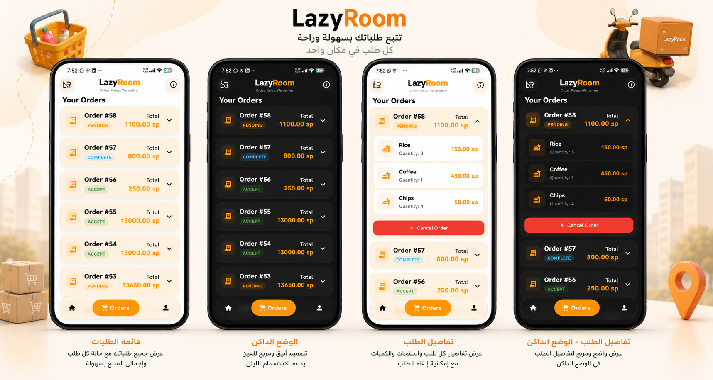<br/><sub>My Orders</sub></td>
    <td align="center">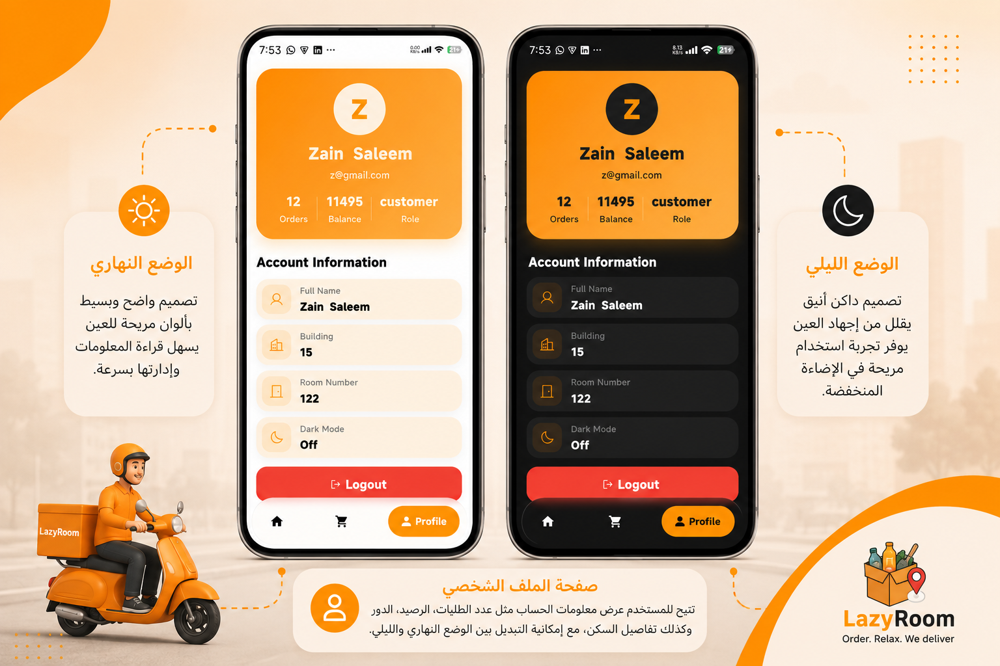<br/><sub>Profile</sub></td>
    <td></td>
  </tr>
</table>

### Supplier Dashboard

<table>
  <tr>
    <td align="center">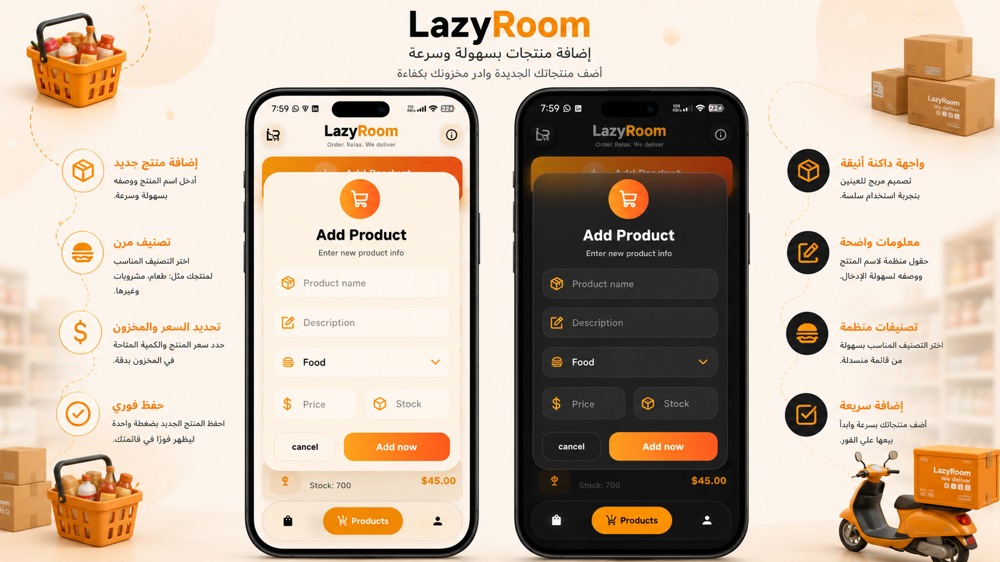<br/><sub>Add Product</sub></td>
    <td align="center">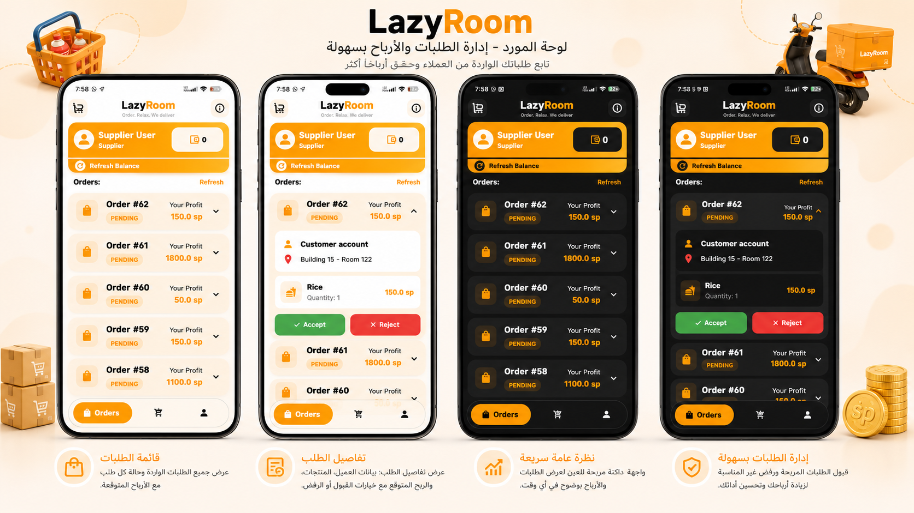<br/><sub>Manage Orders</sub></td>
  </tr>
</table>

### Admin Panel

<table>
  <tr>
    <td align="center">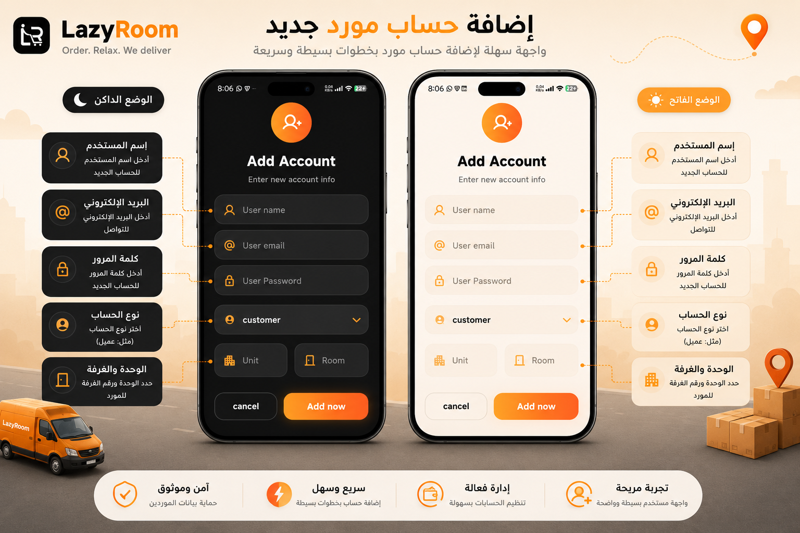<br/><sub>Create Account</sub></td>
    <td align="center">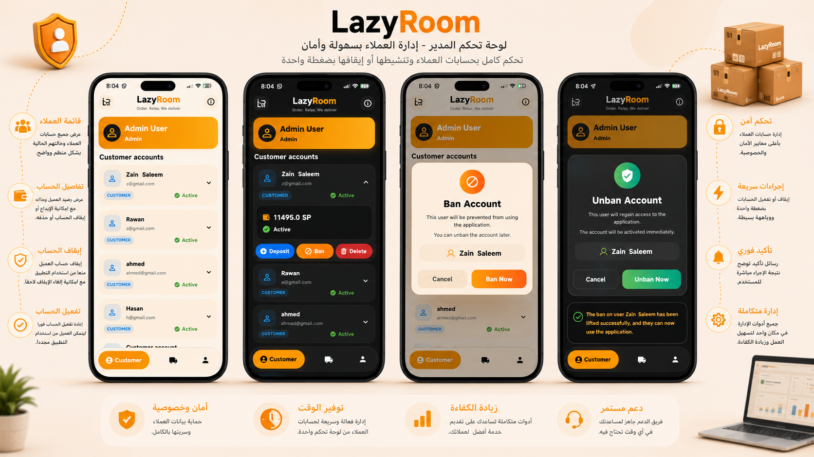<br/><sub>Customer Accounts</sub></td>
    <td align="center">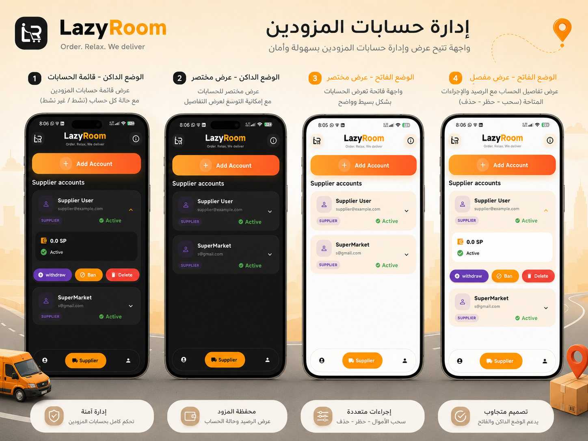<br/><sub>Supplier Accounts</sub></td>
  </tr>
</table>

> ⚠️ **Note:** The screenshot file names above are based on the files listed in your `screenshots/` folder. Since a few names were truncated, double-check that each `src` path exactly matches the real file name (including extension) before pushing to GitHub, and adjust any that don't line up.

---

## 📂 Project Structure

```
lib/
├── controllers/          # App-level controllers (e.g., auth controller)
├── models/               # Data models (User, Product, Order, Account, etc.)
├── providers/            # Provider-based state management
├── services/             # REST API integration layer (auth, products, orders, admin, storage)
├── theme/                # Light/Dark app theming
├── views/
│   ├── admin_views/      # Admin-only screens (accounts, profile)
│   ├── customer_views/   # Customer-only screens (home, orders, profile)
│   └── supplier_views/   # Supplier-only screens (products, orders, profile)
├── widgets/
│   ├── dialogs/          # Reusable dialogs (cart, add/edit product, ban, deposit, etc.)
│   └── listes_view/      # Reusable list views for products, orders, and accounts
└── main.dart             # App entry point
```

---

## 🤝 Contributing

Contributions, issue reports, and feature suggestions are welcome. Feel free to open an issue or submit a pull request.

---

## 📄 License

This project currently has no license specified. Add a `LICENSE` file if you'd like to open-source it under a specific license (e.g., MIT).

---

## 👤 Author

Developed by **Zain** — Independent Flutter Developer.